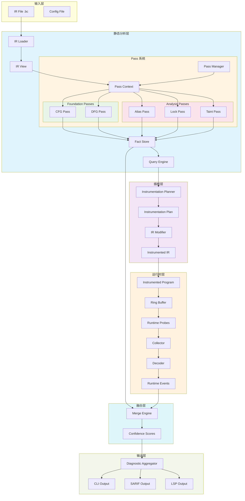
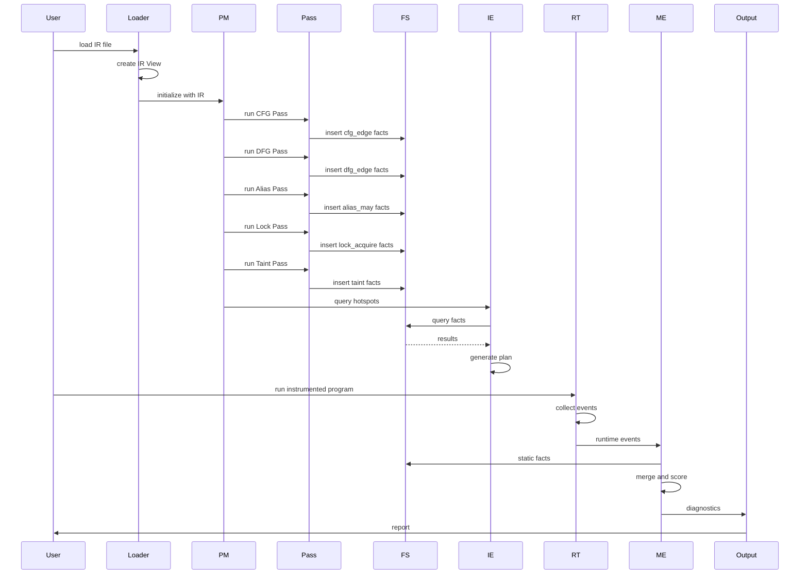
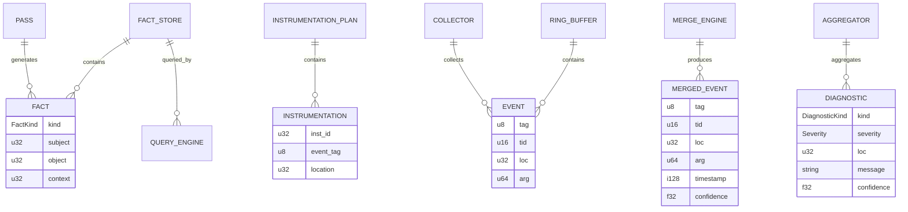

# OmniScope 架构设计 (Architecture Design)

本文档定义 OmniScope 的完整架构，所有实现必须严格遵循此架构。

---

## 🏗️ 整体架构图



---

## 📐 数据流架构



---

## 🧩 组件详细架构

### 1. IR 层 (IR Layer)

**职责**: LLVM IR 的极薄封装，零抽象

**组件**:

```
src/ir/
├── llvm_c.zig          # LLVM-C API 绑定
├── view.zig            # IR View (指针包装器)
├── location.zig        # 位置信息
└── debug_info.zig      # DWARF 调试信息
```

**架构约束**:
- ✅ 只包装 LLVM 指针
- ❌ 不做任何缓存
- ❌ 不做任何计算

**数据结构**:

```zig
// IR View - 零抽象
ValueRef {
    raw: *llvm.LLVMValueRef
}

BasicBlockRef {
    raw: *llvm.LLVMBasicBlockRef
}

FunctionRef {
    raw: *llvm.LLVMValueRef
}

ModuleRef {
    raw: *llvm.LLVMModuleRef
}
```

---

### 2. Pass 系统 (Pass System)

**职责**: 静态分析的编排和执行

**组件**:

```
src/pass/
├── pass.zig            # Pass 接口
├── manager.zig         # Pass Manager
├── foundation/
│   ├── cfg.zig         # CFG Pass
│   └── dfg.zig         # DFG Pass
└── analysis/
    ├── alias.zig       # Alias Pass
    ├── lock.zig        # Lock Pass
    └── taint.zig       # Taint Pass
```

**架构约束**:
- ✅ Pass 只能通过 Fact Store 通信
- ❌ Pass 之间不能直接调用
- ❌ Pass 不能直接访问 IR View（通过 PassContext）

**依赖关系**:

```
CFG Pass (无依赖)
    ↓
DFG Pass (依赖: CFG)
    ↓
Alias Pass (依赖: CFG, DFG)
    ↓
Lock Pass (依赖: CFG, DFG, Alias)
    ↓
Taint Pass (依赖: CFG, DFG, Alias)
```

**Pass 接口**:

```zig
Pass {
    name: []const u8
    kind: PassKind
    deps: []const []const u8
    run(ctx: *PassContext, diag: *DiagnosticWriter) !void
}
```

---

### 3. Fact 系统 (Fact System)

**职责**: 唯一的语义共享机制

**组件**:

```
src/fact/
├── fact.zig            # Fact 类型定义
├── store.zig           # Fact Store (SoA)
└── query.zig           # Query Engine
```

**架构约束**:
- ✅ Fact Store 是 SoA (Structure of Arrays)
- ✅ Fact Store 是 append-only
- ✅ 所有 Pass 通过 Fact Store 通信
- ❌ 不能绕过 Fact Store 直接通信

**数据结构**:

```zig
// Fact Store - SoA 布局
FactStore {
    kinds: []FactKind    // 类型数组
    subj:  []u32        // 主题数组
    obj:   []u32        // 对象数组
    ctx:   []u32        // 上下文数组
}

// Fact - 逻辑视图
Fact {
    kind: FactKind
    subject: u32
    object: u32
    context: u32
}
```

**Fact 类型**:

```zig
FactKind {
    cfg_edge        // 控制流边
    dfg_edge        // 数据流边
    alias_may       // 可能别名
    alias_must      // 必然别名
    lock_acquire    // 锁获取
    lock_release    // 锁释放
    taint           // 污点传播
    allocation      // 内存分配
}
```

---

### 4. 插桩系统 (Instrumentation System)

**职责**: 基于静态分析结果生成插桩计划

**组件**:

```
src/pass/instrumentation/
└── planner.zig         # Instrumentation Planner
```

**架构约束**:
- ✅ 插桩点由静态分析决定
- ✅ 插桩在 LLVM LateOptimization 阶段
- ❌ Runtime 不能独立决定插桩点

**数据流**:

```
Fact Store → Query Engine → Instrumentation Planner → Instrumentation Plan → IR Modifier
```

**数据结构**:

```zig
InstrumentationPlan {
    instrumentations: []Instrumentation
}

Instrumentation {
    inst_id: u32        // 指令 ID
    event_tag: u8       // 事件标签
    location: u32       // 位置 ID
}
```

---

### 5. 运行时系统 (Runtime System)

**职责**: 低开销的事件收集

**组件**:

```
src/runtime/
├── rt_lib/
│   ├── probes.zig      # Probe 函数
│   └── ring_buffer.zig # Ring Buffer
├── collector.zig       # 事件收集器
└── merge.zig           # 合并引擎
```

**架构约束**:
- ✅ Probe 极简，零错误
- ✅ Ring Buffer 是 SPSC (单生产者单消费者)
- ✅ 使用原子操作，无锁
- ❌ Runtime 不做分析，只收集数据

**数据结构**:

```zig
// Event - 压缩格式
Event {
    tag: u8             // 事件类型
    tid: u16            // 线程 ID
    loc: u32            // 位置 ID
    arg: u64            // 参数
}

// Ring Buffer - SPSC
RingBuffer {
    buf: [CAPACITY]Event
    head: AtomicU32     // 生产者索引
    tail: AtomicU32     // 消费者索引
}
```

**Probe 类型**:

```zig
EventTag {
    alloc = 1           // 内存分配
    free = 2            // 内存释放
    lock_acquire = 3    // 锁获取
    lock_release = 4    // 锁释放
    taint_source = 5    // 污点源
    taint_sink = 6      // 污点汇
}
```

---

### 6. 融合系统 (Merge System)

**职责**: 静态事实与运行时事件的融合

**组件**:

```
src/runtime/
└── merge.zig           # Merge Engine
```

**架构约束**:
- ✅ 静态分析引导运行时验证
- ✅ 计算置信度分数
- ❌ 不能仅依赖运行时数据

**数据流**:

```
Static Facts + Runtime Events → Merge Engine → Confidence Scores → Diagnostics
```

**置信度计算**:

```
Base: 0.5 (无静态信息)
+ Static Facts: +0.3
+ Runtime Events: +0.2
= Final: [0.0, 1.0]
```

**数据结构**:

```zig
MergedEvent {
    tag: u8
    tid: u16
    loc: u32
    arg: u64
    timestamp: i128
    confidence: f32     // 置信度 [0.0, 1.0]
}
```

---

### 7. 输出系统 (Output System)

**职责**: 多格式诊断输出

**组件**:

```
src/output/
├── cli.zig             # CLI 输出
├── sarif.zig           # SARIF 输出
└── lsp.zig             # LSP 输出
```

**架构约束**:
- ✅ 统一的 Diagnostic 接口
- ✅ 支持多种输出格式
- ❌ 输出层不能修改数据

**数据结构**:

```zig
Diagnostic {
    kind: DiagnosticKind
    severity: Severity
    loc: u32
    message: []const u8
    confidence: f32
}

DiagnosticKind {
    static_issue
    runtime_issue
    anomaly
    performance
    security
}

Severity {
    info = 0
    warning = 1
    error = 2
}
```

---

## 🔗 组件间通信架构

### 通信原则

1. **IR 层 → Pass 系统**: 通过 PassContext
2. **Pass 系统 → Fact 系统**: 通过 Fact Store
3. **Pass 系统 → 插桩系统**: 通过 Fact Store + Query Engine
4. **插桩系统 → 运行时系统**: 通过 Instrumentation Plan
5. **运行时系统 → 融合系统**: 通过 Runtime Events
6. **Fact 系统 → 融合系统**: 通过 Fact Store
7. **融合系统 → 输出系统**: 通过 Diagnostic

### 禁止的通信

❌ Pass 之间直接调用
❌ Pass 直接访问 IR View
❌ Runtime 直接访问 IR
❌ 绕过 Fact Store 的通信

---

## 📊 数据结构关系图



---

## 🎯 实现约束检查清单

### IR 层
- [ ] ValueRef 只包含 raw 指针
- [ ] 无缓存字段
- [ ] 无计算方法
- [ ] 所有方法直接调用 LLVM-C API

### Pass 系统
- [ ] Pass 只通过 Fact Store 通信
- [ ] Pass Manager 实现依赖解析
- [ ] PassContext 包含 Fact Store 引用
- [ ] 无 Pass 间直接调用

### Fact 系统
- [ ] Fact Store 使用 SoA 布局
- [ ] Fact Store 是 append-only
- [ ] Query Engine 只读操作
- [ ] 无绕过 Fact Store 的通信

### 插桩系统
- [ ] 插桩点由静态分析决定
- [ ] Instrumentation Plan 可序列化
- [ ] Event 标签与 Probe 对应

### 运行时系统
- [ ] Probe 极简，零错误
- [ ] Ring Buffer 是 SPSC
- [ ] 使用原子操作
- [ ] 无锁设计

### 融合系统
- [ ] 置信度基于静态+运行时
- [ ] 静态分析引导运行时
- [ ] 输出置信度分数

### 输出系统
- [ ] 统一 Diagnostic 接口
- [ ] 支持多种格式
- [ ] 不修改数据

---

## 🔄 Pipeline 执行流程

### 静态分析流程

```
1. Load IR
   ↓
2. Create IR View
   ↓
3. Initialize PassContext with IR + FactStore
   ↓
4. PassManager.resolveDependencies()
   ↓
5. Execute passes in order:
   - CFG Pass → insert cfg_edge facts
   - DFG Pass → insert dfg_edge facts
   - Alias Pass → insert alias_may facts
   - Lock Pass → insert lock_acquire facts
   - Taint Pass → insert taint facts
   ↓
6. QueryEngine.query() for hotspots
   ↓
7. InstrumentationPlanner.generatePlan()
   ↓
8. Output diagnostics
```

### 运行时流程

```
1. Load instrumented IR
   ↓
2. Link with runtime library
   ↓
3. Execute program
   ↓
4. Probes write to Ring Buffer
   ↓
5. Collector reads from Ring Buffer
   ↓
6. Decoder decodes events
   ↓
7. MergeEngine.merge(static_facts, runtime_events)
   ↓
8. Output diagnostics with confidence
```

---

## 📐 模块边界

### 明确的边界

| 边界 | 从 | 到 | 接口 |
|------|----|---|------|
| IR → Pass | IR Layer | Pass System | PassContext |
| Pass → Fact | Pass System | Fact System | FactStore.insert() |
| Fact → Query | Fact System | Query Engine | FactStore |
| Fact → Instrumentation | Fact System | Instrumentation | QueryEngine |
| Instrumentation → Runtime | Instrumentation System | Runtime System | InstrumentationPlan |
| Runtime → Merge | Runtime System | Merge System | Runtime Events |
| Fact → Merge | Fact System | Merge System | Fact Store |
| Merge → Output | Merge System | Output System | Diagnostic |

### 禁止的边界

❌ Pass → Pass (直接调用)
❌ Pass → IR (直接访问)
❌ Runtime → IR (直接访问)
❌ Runtime → Runtime (独立进程)

---

## ✅ 架构验证

每个组件实现后必须验证：

1. **IR 层**: 无缓存，零抽象
2. **Pass 系统**: 只通过 Fact Store 通信
3. **Fact 系统**: SoA，append-only
4. **插桩系统**: 静态引导
5. **运行时系统**: 极简，无锁
6. **融合系统**: 置信度计算
7. **输出系统**: 多格式支持

---

**所有实现必须严格按照此架构进行，不得随意修改或绕过架构约束。**