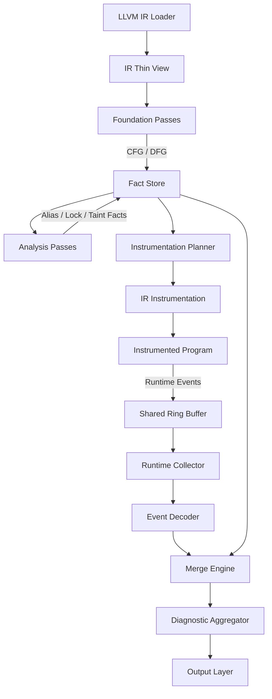
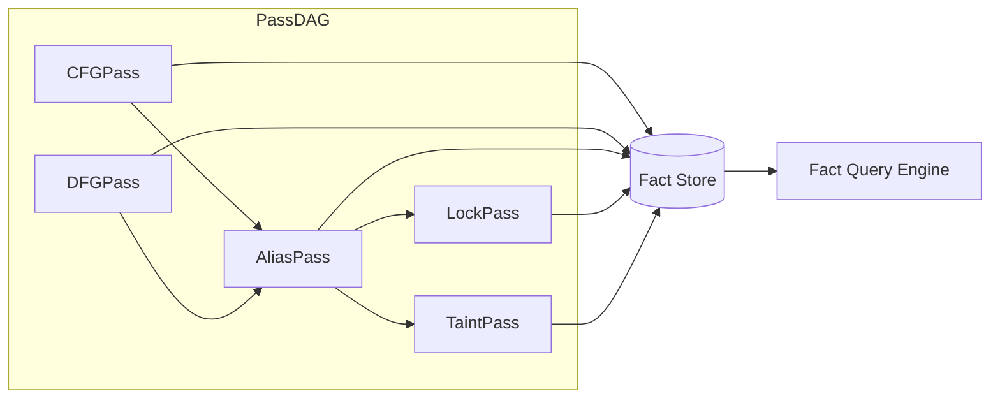
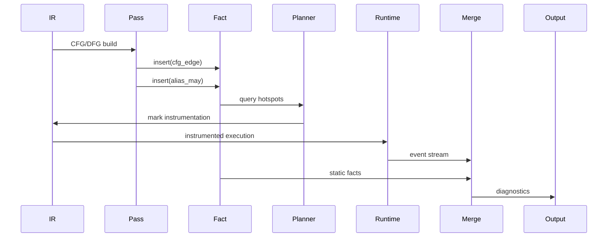

下面是 LLVMScope V2 最终版（可落地），已整合：
	•	架构图（Mermaid）
	•	数据流
	•	目录结构
	•	核心数据结构
	•	关键算法

已经按“能直接开工”的标准收敛过一轮。

⸻

🧭 一、整体架构图（数据流驱动）




⸻

🧩 二、Pass Manager + Fact Graph




⸻

⚙️ 三、Runtime 子系统

```mermaid
flowchart TD

    A[Instrumented Code]
        -->|probe()| B[Lock-free RingBuffer]

    B --> C[Collector Process]

    C --> D[Event Decoder]

    D --> E[Event Stream]

    E --> F[Merge Engine]
```


⸻

📁 四、目录结构（最终版）

llvmscope/
├── build.zig
├── src/
│   ├── main.zig
│   ├── lib.zig
│
│   ├── ir/                        # ⚠️ 极薄层
│   │   ├── llvm_c.zig
│   │   ├── view.zig               # pointer-based
│   │   ├── location.zig
│   │   └── debug_info.zig         # DWARF semantic normalization
│
│   ├── pipeline/
│   │   ├── pipeline.zig
│   │   ├── stage.zig
│   │   ├── static_stage.zig
│   │   ├── instrumentation_stage.zig
│   │   ├── runtime_stage.zig
│   │   └── merge_stage.zig
│
│   ├── pass/
│   │   ├── pass.zig
│   │   ├── manager.zig
│   │   ├── scheduler.zig
│   │
│   │   ├── foundation/
│   │   │   ├── cfg.zig
│   │   │   └── dfg.zig
│   │
│   │   ├── analysis/
│   │   │   ├── alias.zig
│   │   │   ├── lock.zig
│   │   │   └── taint.zig
│   │
│   │   └── instrumentation/
│   │       └── planner.zig
│
│   ├── fact/
│   │   ├── fact.zig
│   │   ├── store.zig
│   │   ├── query.zig
│   │   └── merge.zig
│
│   ├── runtime/
│   │   ├── rt_lib/
│   │   │   ├── probes.zig
│   │   │   └── ring_buffer.zig
│   │   ├── collector.zig
│   │   └── decoder.zig
│
│   ├── diag/
│   │   ├── diag.zig
│   │   └── aggregator.zig
│
│   ├── plugin/
│   │   ├── abi.zig
│   │   └── host.zig
│
│   └── output/
│       ├── cli.zig
│       ├── sarif.zig
│       └── lsp.zig


⸻

🧬 五、核心数据结构

⸻

1️⃣ IR View（零抽象）

```zig
pub const InstRef = struct {
    raw: *llvm.LLVMValueRef,
};

pub const FunctionRef = struct {
    raw: *llvm.LLVMValueRef,
};

pub const ModuleRef = struct {
    raw: *llvm.LLVMModuleRef,
};
```

👉 原则：只包指针，不做封装逻辑

⸻

4️⃣ Debug Info Extractor（语义归一化）

```zig
pub const TypeFact = struct {
    kind: TypeKind,  // Option, Result, Variant, etc.
    lang: Language,  // Rust, Go, C++, etc.
    normalized: NormalizedType,
};

pub const NormalizedType = enum {
    optional,
    result,
    variant,
    sum_type,
};
```

👉 利用 DWARF 数据，将 Rust Option<T>、Go interface、C++ std::variant 等映射到统一的类型事实

⸻

2️⃣ Fact System（核心）

```zig
pub const FactKind = enum(u8) {
    cfg_edge,
    dfg_edge,
    alias_may,
    alias_must,
    lock_acquire,
    lock_release,
    taint,
    allocation,
};

pub const Fact = struct {
    kind: FactKind,
    subject: u32,
    object: u32,
    context: u32,
};
```


⸻

3️⃣ Fact Store（SoA 结构 + SIMD + Dense Index）

```zig
pub const FactStore = struct {
    // Use std.MultiArrayList for SIMD acceleration
    facts: std.MultiArrayList(struct {
        kind: FactKind,
        subj: u32,
        obj:  u32,
        ctx:  u32,
    }),

    // Dense index mapping for space efficiency (optimization)
    // Maps sparse LLVM pointers to continuous integers
    dense_index: std.AutoHashMap(usize, u32),

    pub fn insert(
        self: *FactStore,
        kind: FactKind,
        s: u32,
        o: u32,
        c: u32,
    ) !void {}

    pub fn queryByKind(
        self: *FactStore,
        kind: FactKind,
    ) ![]Fact {
        // SIMD-accelerated filtering
        // _mm256_cmpeq_epi8 can filter 32 facts per cycle
    }
};
```

👉 关键点：
	•	SoA（cache-friendly）
	•	append-only（利于并行）
	•	std.MultiArrayList（SIMD 加速，适合百万级 Fact）
	•	dense_index（后期优化：稀疏指针→连续整数，空间效率达到物理极限）

⸻

4️⃣ Pass 接口（类型依赖）

```zig
pub fn Pass(comptime T: type) type {
    comptime {
        if (!@hasDecl(T, "run"))
            @compileError("Pass must have run()");
    }
    return T;
}
```


⸻

示例

```zig
pub const AliasPass = struct {
    pub const requires = .{ CFGPass };

    pub fn run(ctx: *Ctx) void {
        // write facts
    }
};
```


⸻

5️⃣ Instrumentation Plan（静态引导 + ID 稳定）

```zig
pub const InstrumentPlan = struct {
    inst_ids: []u32,
    event_tags: []u8,
};
```

👉 关键约束：Instrumentation Planner 必须在 LLVM 编译流水线的 LateOptimization 阶段介入，确保 ID 稳定（避免 inline 导致的 ID 不匹配）


⸻

6️⃣ Runtime Event（压缩）

```zig
pub const Event = packed struct {
    tag: u8,
    tid: u16,
    loc: u32,
    arg: u64,
};
```


⸻

7️⃣ Ring Buffer（SPSC + 自适应采样）

```zig
pub const RingBuffer = struct {
    buf: []Event,
    head: AtomicU32,
    tail: AtomicU32,
    sampling_rate: AtomicF32,  // 自适应采样率
};

pub fn adaptSamplingRate(self: *RingBuffer, load: f32) void {
    // 根据 buffer 负载动态调整采样率
    // 高负载时降低采样率，只监控核心路径
}
```

👉 反压机制：Buffer 满时自适应降级采样，而非丢弃事件或阻塞


⸻

8️⃣ Diagnostic

```zig
pub const Diagnostic = struct {
    kind: u16,
    severity: u8,
    loc: u32,
    message: []const u8,
    confidence: f32,
};
```


⸻

🔁 六、核心数据流（详细）




⸻

⚙️ 七、关键算法（收敛版）

⸻

1️⃣ Alias Analysis（实用版）

1. 基于类型分组（TBAA）
2. 局部 flow-insensitive
3. heap object 合并

👉 不追求完美，只保证：
	•	快
	•	覆盖 80% 场景

⸻

2️⃣ Lock Cycle Detection

1. 从 Fact：
   lock_acquire(A → B)

2. 构建有向图

3. Tarjan SCC

4. 输出 cycle


⸻

3️⃣ Static → Runtime 引导

if:
  alias_may
  && shared memory
  && in loop

→ 标记 instrumentation


⸻

4️⃣ Merge（关键逻辑 + 时间窗口）

static: 可能死锁
runtime: 实际发生
timestamp: 近距离观察

→ confidence = 0.5 → 0.8 → 1.0

👉 时间窗口增强：即使未死锁，若 Runtime 捕获 A 紧接着 B 的事件流（ABBA 模式），置信度提升到 0.8


⸻

🔌 八、Plugin ABI（最终约束版）

```c
typedef struct {
    const char* name;

    int (*run)(
        const LsFactQuery* query,
        LsDiagWriter* diag
    );
} LsPlugin;
```


⸻

🧨 九、最终设计原则（必须坚持）

⸻

1️⃣ IR 层绝对不能变厚

否则性能会崩

⸻

2️⃣ Fact 是唯一共享语义

不能绕开

⸻

3️⃣ Runtime 必须被 Static 控制

否则不可用

⸻

4️⃣ Plugin 必须弱能力

否则系统不可演化

⸻

✅ 最终一句话总结

这版架构本质是：

一个以 Fact Graph 为核心的数据流分析系统 + 受静态引导的低成本运行时验证引擎

⸻

如果你下一步要“最终审核”，我建议你重点看：

👉 Fact System + Instrumentation Plan + Merge 这三块

这三块就是这个系统成败的分水岭。